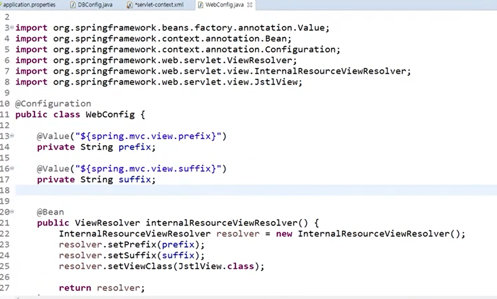

# Java_Study

##### intelliJ 단축키

+ alt + enter : 자동 import

# Spring

## 10/11

+ spring framework 특징 - 객체 관리 컨테이너 / 의존성 주입과 제어역전이 가장 중요함
  + POJO(Plain Old Java Object) : EJB가 기능 작성을 위해서 인터페이스를 구현하거나 상속하는 것에 비해 일반적인 자바 객체를 이용해서 그대로 사용할 수 있음을 의미한다.
  + 의존성(new, 객체 생성) 주입(DI, Dependency Injection)을 통한 객체 관계 구성 : 프레임워크 내부에서 사용되는 객체간 의존성이 존재할 경우, 개발자는 의존성에 관련한 설정만 해주면 실제 의존성 생성은 프레임워크가 담당한다.
    + 내가 사용할 **객체를 다른게 만들어** 주는 것
  + 관점지향 프로그래밍(AOP, Aspect Oriented Progeamming) 지원 : 트랜잭션, 로깅 등 여러 모듈에서 공통적으로 사용하는 기능에 대해서 별도로 분리하여 작성, 관리할 수 있는 기능을 제공한다.
  + 제어 역전(IoC, inversion of Control) : 내가 사용할 **객체를 프레임워크가 만들어**준다. 의존성 주입과 비슷한 개념
  + 높은 확장성과 다양한 라이브러리 지원 : 영속성 관련하여 Mybatis나 Hibernate 등 완성도 높은 데이터 베이스 라이브러리와 연결가능한 인터페이스를 제공한다.
    + ORM(Mybatis, Hibernate) : 이름과 타입을 알아서 지정해줌(DTO를 알아서 지정)

##### 중요

1. Framework에 대한 이해
2. DI, IoC 개념
3. Spring 개발 환경
4. Spring 환경설정
   + 컨테이너에 객체 등록, 의존 관계

### IntelliJ 단축키

+ alt + insert : Generate(get, set 등등)
+ ctrl + d : 한 줄씩 아래로 복사
+ alt + shift + 방향키 : 커서 있는 줄 잡고 방향키 방향으로 이동

### IntelliJ Spring Boot Framework 오류

FAILURE: Build failed with an exception.

1. Gradle 상위 폴더 우클릭 후 Open Gradle config 열고 pulgins 안에 두번째 줄에 version을 2.7.7로 바꿔주기

2. sourceCompatibility를 11로 바꿔주기

### Spring Framework 시작

+ spring누르고 Maven 선택...

### resource 폴더

* bean 태그만들기
  
  * ```
    <bean class="com.spring.Public.Desktop" id="desktop"></bean>
    
    // 위 대문자 Desktop이 아래의 new 다음 Desktop
    // 위 id가 아래의 desktop
    
    Desktop desktop = new Desktop();
    ```

### 설정자 주입과 생성자 주입의 차이

##### 설정자 주입

+ 중간에 의존관계를 자바코드 딴에서 동적으로 바꿔 끼울수 있다.
+ 생성자 주입보다 자유도가 높다

##### 생성자 주입

+ 주입을 하지 않고는 절대로 객체를 생성할 수 없다.
+ 설정자 주입보다 엄격함

##### spring archeitecture

+ Core : Ioc - 가장 기본의 컨테이너 기능

+ DAO : JDBC Support
  
  + 쓰기 힘든 이유
    + 자원관리
    + 파라미터 매핑
    + 결과 매핑

+ ORM : 외부 ORM 연동

+ Web : MVC

+ AOP

##### context

```
<?xml version="1.0" encoding="UTF-8"?>
<beans xmlns="http://www.springframework.org/schema/beans"
       xmlns:xsi="http://www.w3.org/2001/XMLSchema-instance"
       xmlns:context="http://www.springframework.org/schema/context"
       xsi:schemaLocation="http://www.springframework.org/schema/beans http://www.springframework.org/schema/context http://www.springframework.org/schema/beans/spring-beans.xsd">
<!--    component-scan : 지정된 패키지에서 낙인이 찍힌 클래스를 모두 bean으로 등록한다.-->
    <context:component-scan base-pakage="com.spring.Public"/>

</beans>
```

+ 낙인의 종류
  
  + ```
    @Component  
    ```
  
  + ```
    @Autowired (Spring에서 권장)
    // 한개일때 자동으로 타입이 일치하는 bean을 찾아서 context로 넣어줌
    // private도 뚫어줌 : 내부 구현의 reflection 기술을 활용해서 가능
    // 두개 이상이면 에러남
    // 여러개일지라도 하나의 빈이 자신과 이름이 같다면 이름이 같은 빈을 의존설정한다.
    ```
  
  + ```
    @Component("원하는 이름") 
    // 낙인을 찍을 때 그냥 찍으면 클래스명 첫글자 소문자 / 이름을 정해주면 정해준 이름으로 빈이 등록된다.
    ```
  
  + ```
    Qualifier("원하는 이름") 
    // @Autowired와 비슷
    // 두개 이상일 때 하나의 빈이 자신과 이름이 같다면 이름이 같은 빈을 의존설정한다.
    ```

### 최종 정리 - 편한거 써라

+ 설정자 주입
  + property
    + value
    + ref : 빈 객체
+ 생성자 주입
  + constructor-arg
+ 설정자 주입_Annotation
  + context:component-scan
    + base-package
  + 낙인을 찍고 낙인에 이름도 넣을 수 있다.

##### 추가

+ 아래 개념 설명 및 예시 코드
  
  + https://velog.io/@leesomyoung/Java-DAO-DTO-VO%EC%9D%98-%EA%B0%9C%EB%85%90

+ DAO?
  
  + Data Access Object의 약자로, 데이터베이스의 데이터에 접근하기 위해 생성하는 객체이다.
    
    데이터베이스에 접근하기 위한 로직과 비즈니스 로직을 분리하기 위해 사용한다.
    
    간단하게, DB에 접속하여 데이터의 CRUD(생성, 읽기, 갱신, 삭제) 작업을 시행하는 클래스이다.
    
    JSP 및 Servlet 페이지 내에 로직을 기술하여 사용할 수 있지만, 코드의 간결화 및 모듈화, 유지보수 등의 목적을 위해 별도의 DAO 클래스를 생성하여 사용하는 것이 좋다.
    
    한 줄 요약 : DAO는 DB를 사용하여 데이터의 조회 및 조작하는 기능을 전담하는 오브젝트이다.

+ DTO
  
  + Data Transfer Object의 약자로, 계층간 데이터 교환을 위한 자바빈즈를 뜻한다.
    
    또한 DTO는 VO(Value Object)와 용어를 혼용해서 많이 사용하는데, VO는 읽기만 가능한 read only 속성을 가져 DTO와의 차이점이 존재한다.
    
    일반적으로 DTO는 로직을 가지고 있지 않은 순수한 데이터의 객체이며 객체의 속성과 그 속성의 접근을 위한 getter 및 setter 메소드만을 가지고 있다.
    
    한 줄 요약 : DTO는 VO와 혼용하여 사용하며, 순수한 데이터의 객체이다.

+ VO
  
  + VO는 Value Object의 약자로, `Read-Only` 속성을 가진 `값 오브젝트`이다. 자바에서 단순히 값 타입을 표현하기 위하여 불변 클래스(Read-Only)를 만들어 사용한다. 따라서 `getter`기능만 존재한다.

## 10/12

### AOP(Aspect Oriented Programming) : 관점지향프로그래밍

* OOP는 수직적, AOP는 수평적

* Spring Ioc를 보완해주는 역할

* 용어
  
  * Aspect : 여러 클래스에 공통적으로 구현되는 관심사의 모듈화(조립하기 위해 따로 만들어 놓은 것)
  
  * Join Point : 메서드 실행이나 예외처리와 같은 프로그램 실행중의 특정 지점, Spring에서는 메서드 실행을 의미한다.
  
  * Advice : 특정 Join Point(pointcut)에서 Aspect에 의해서 취해진 행동
    
    * Around, Before, After 등의 Advice타입이 존재
  
  * Pointcut : Join Point에 Aspect를 적용하기 위한 조건 서술, Aspect는 지정한 pointcut에 일치하는 모든 Join Point에서 실행된다.(pointcut에 Aspect가 합체됨)
  
  * Target 객체 : 하나이상의 advice가 적용될 객체, Spring AOP는 Runtime Proxy를 사용하여 구현되므로 객체는 한상 Proxy 객체가 된다.
  
  * AOP Proxy : AOP를 구현하기 위해 AOP 프레임워크에 의해 생성된 객체, Spring framework에서 AOP Proxy는 JDK dynamic proxy 또는 CGLIB proxy다.
  
  * Weaving : Aspect를 다른 객체와 연결하여 Advice 객체를 생성, 런타임 또는 로딩시 수행할 수 있지만 Spring AOP는 런타입에 위빙을 수행(Advice가 Target에 적용되는 동작을 Weaving이라고 한다.)

* 용어 예시
  
  * doSomething();이라는 함수가 호출되는 것을 pointcut으로 잡고 입실체크를 Aspect1, 퇴실체크를 Aspect2로 지정, doSomething before에 Aspect1,  doSomething after에 Aspect2로 advice세팅 


### MVC

##### Controller

* 클라이언트가 서버에 요청(중간에 필터가 인코딩을 할 수 있음)을 하면 서버의 Server에서 Controller에 있는 servlet이 받는다. 

* 요청이 get, post방식으로 key와 value가 들어오면 getparameter 로 처리할 수 있었다.

* 가벼운것들은 컨트롤러에서 주로 처리했는데 로직은 컨트롤러에서 처리를 해야하나?

* 로직은 model로 넘긴다. controller보다 model이 더 큼

* Model And View : 서블릿을 디스패쳐 서블릿(만들어진 것을 사용할 것)으로 앞으로 빼주고(Pojo) Controller는 자바로만 작성


##### Model

* service
  
  * 비즈니스 로직

* Dao(repository)
  
  * DB 소통

* controller에서 Model로 요청을 할 때 service로 넘김, service에서 Dao로 넘김

* service에서 아무런 일도 하지 않을 때에도 꼬임방지로 통일성있게 위와 같은 방식으로 요청을 함

* service에서 데이터가 필요하면 Dao를 갔다가 돌아오고 다시 Controller로 보내줌

* Dao에서는 필요에 따라 DB와 소통을 하고 service로 넘겨줌

* 순서
  
  * 클라이언트 > contoller(service > (Dao) > (DB))
  
  * (DB) > (Dao) > service > contoller > 클라이언트

* DB소통은 sql문

* DTO(VO) : service와 Dao 사이에서 데이터를 주고받고를 도와주는 바구니 역할

* Dao, DTO를 사용


##### View

* 포워딩, 리다이렉트는 View(JSP)로 결과를 넘겨준다.

* WEB-INF 폴더 안에 .jsp파일을 감춰놓음

* 공통으로 계속 사용되는 애들임(index 등을 통해 자동으로 보내줌)

* 나중에 View를 controller에서 data만 json으로 보내준다.

* Vue.js로 꾸미고 클라이언트에게 보여줌


### REST API

* 순수하게 요청받은 데이터를 제공한다.

* REST는 하나의 URL은 하나의 고유한 리소스(Resource)를 대표하도록 설계된다는 개념에 전송방식을 결합해서 원하는 작업을 결합해서 원하는 작업을 지정한다.

* HTTP(통신 규약) URI를 통해 제어할 자원을 명시하고, HTTP Method(GET, POST, PUT, DELETE)를 통해 해당 자원을 제어하는 명령을 내리는 방식의 아키택쳐

* REST 구성
  
  * 자원 : URI
  
  * 행위 : HTTP Method
  
  * 표형 : Representations
  
  * 잘 표현된 HTTP URI로 리소스를 정의하고 HTTP Method로 리소스에 대한 행위를 정의한다. 리소스는 JSON, XML과 같은 여러가지 언어로 표현할 수 있다.

* CRUD
  
  * 작업 - 기존 메서드 - REST 메서드 - 비고
  
  * Create - POST - POST - 글쓰기
  
  * Read - GET - GET - 글읽기
  
  * Update - POST - PUT - 글수정
  
  * Delete - GET - DELETE - 글삭제

* 암묵적인 룰(표준이 없음)
  
  * 하이픈(-)은 사용가능하지만 언더바(__)는 사용하지 않는다.
  
  * 특별한 경우 말고는 대문자를 사용하지 않는다.
  
  * URl 마지막에 슬래시(/)를 사용하지 않는다.
  
  * 슬래시로 계층 관계를 나타낸다.
  
  * 확장자가 포함된 파일 이름을 직접 포함시키지 않는다.
  
  * URI는 명사를 사용한다.


##### Spring REST 관련 Annotation 및 클래스

| Annotation                                                      | Description                        |
| --------------------------------------------------------------- | ---------------------------------- |
| @GetMapping<br/>@PostMapping<br/>@PutMapping<br/>@DeleteMapping | 요청방식                               |
| @RestController                                                 | Controller가 REST방식을 처리하기 위한 것임을 명시 |
| @ResponseBody                                                   | Data 자체를 전달(JSP 같은 뷰로 전달 x)        |
| @PathVariable                                                   | URL 경로에 있는 값을 파라미터로 추출.            |
| @CrossOrigin                                                    | Ajax의 크로스 도메인 문제를 해결               |
| @RequestBody                                                    | JSON 데이터를 원하는 타입으로 바인딩             |
| @ResponseEntity                                                 | 데이터 응답시 [상태코드, 헤더, 데이터] 설정이 가능     |


### REST API 실습

```java
package com.ssafy.controller;

@Controller
@RequestMapping("/rest1")
public class TestController{
    @Getmapping("/test1")
    public String test1(){
        return "hi rest"
    }
}
```

intelliJ에서 spring MVN을 하는법을 몰라서 Swagger로 넘어감..


### Swagger - Spring Boot랑 조금 달라서 요까지만

* REST API 문서화
  
  * 간단한 설정으로 프로젝트의 API목록을 웹에서 확인 및 테스트 할 수 있게 해주는 Library
  
  * Controller에 정의되어 있는 모든 URL을 바로 확인할 수 있다.

* Swagger 적용
  
  * MVN Repository > 검색 > Springfox Swagger UI > 3.0.0 해보고 안되면 2.7.0
  
  * MVN Repository > 검색 > Springfox Swagger2 > 3.0.0 해보고 안되면 2.7.0
  
  * ```xml
    pom.xml에 적용
    <dependency>
        <groupId>io.springfox</groupId>
        <artifactId>springfox-swagger-ui</artifactId>
        <version>2.7.7</version>
    <!--    <version>3.0.0</version>    -->
    </dependency>
    <dependency>
        <groupId>io.springfox</groupId>
        <artifactId>springfox-swagger2</artifactId>
        <version>2.7.7</version>
    <!--    <version>3.0.0</version>    -->
    </dependency>
    ```


### 대망의 Spring Boot

+ https://start.spring.io/
  + Maven
  + Java
  + 2.7.7
  + Jar
  + 8
  + Spring Boot DevTools
  + spring web
  + lombok - 이건 개인공부..
    + 장점 : DTO(getter, setter)를 @data를 하면 컴파일할때 알아서 생성해준다.
    + 단점 : 상대방에게 lombok이 깔려있지 않다면 읽을 수 없음! / 상대방도 깔려있어야 한다.
+ 아래 Generate 버튼 누르고 파일 받아서 압축풀고 IntelliJ에 넣기
+ 빌드 기다리기


### STS - 강의 기준 Maven

**IntelliJ > new project > Spring Initalizr > Java, Maven, JDK 11, Java 11, Packaging Jar > Next > Spring Boot DevTools, Spring Web, version 2.7.7 등 필요한 것들 체크 잘하기**

프로젝트 생성시 아래 것들을 체크 잘 안하면 변경하면됨 안하면 오류뜸

pom.xml에 parent 아래 version을 2.7.7로 변경 : java11과는 2.7.7이 사용 가능!

pom.xml에 properties 아래 java.version도 11로 변경

| 프로젝트 주요 파일                         | 설명                                                         |
| ------------------------------------------ | ------------------------------------------------------------ |
| src/main/java                              | java source directory                                        |
| 프로젝트 이름Application.java              | application을 시작할 수 있는 main method가 존재하는 스프링 구성 메인 클래스 |
| static                                     | css, js, img등의 정적 resource directory                     |
| templates<br />우리는 이거 대신 JSP를 사용 | SpringBoot에서 사용 가능한 여러가지 View Template(Thymeleaf, Velocity, Freemarker등) 위치 |
| application.properties                     | application 및 스프링의 설정 등에서 사용할 여러가지 property를 정의한 file |
| src/main                                   | jsp등의 리소드 directory                                     |


+ src/main 에서 webapp 폴더를 생성하고 안에 index.html 파일을 만들고 작성을 하고 서버를 키면 자동으로 html파일을 잡아서 화면에 띄워줌

+ 프로젝트 이름Application.java의 하위 모두 Annotation되어 있는 애들을 모두 등록시킴! 이 파일은 최상단에 놔두고 위치 바꾸지 말기

+ JSP

  + jsp 는 Boot에서 기본적으로 제공하는 녀석이 아님

  + ```
    #properties file 추가해야한다.
    spring.mvc.view.prefix=/WEB-INF/views/
    spring.mvc.view.suffix=.jsp
    # 현재 추가해도 warnig 뜸
    ```

  + ```
    #server.servlet.context-path=/ssafy : path 고치기
    #server.port=80 : server port 고치기
    # 얘는 지금 안해도됨
    ```

  + ```
    # pom.xml에 dependency 추가
    # https://mvnrepository.com/artifact/javax.servlet/jstl
    <!-- https://mvnrepository.com/artifact/javax.servlet/jstl -->
    <dependency>
        <groupId>javax.servlet</groupId>
        <artifactId>jstl</artifactId>
    <!-- <version>1.2</version> -->
    </dependency>
    #현재 이거 붙여넣기만 해도 오류 : 넣고 maven 재실행하면 됨 / 버전 상관 x
    ```

  + ```
    # pom.xml에 dependency 추가
    https://mvnrepository.com/artifact/org.apache.tomcat.embed/tomcat-embed-jasper
    <!-- https://mvnrepository.com/artifact/org.apache.tomcat.embed/tomcat-embed-jasper -->
    <dependency>
        <groupId>org.apache.tomcat.embed</groupId>
        <artifactId>tomcat-embed-jasper</artifactId>
    <!-- <version>10.1.1</version> -->
    </dependency>
    #현재 이거 붙여넣기만 해도 오류 : 넣고 maven 재실행하면 됨 / 버전 상관 x / 노란줄뜨면 버전줄 삭제해도 무방
    ```


오전 3 SpringBoot 게시판 강의는 mybatis 강의가 MVC라서 강의 그냥 듣기만 해야함..

dao랑 dto더 공부하려면 mybatis 강의를 듣거나 스프링 책 보기

+ Spring Boot와 Spring의 차이
  + web.xml : 지움
  + bean, property를 바꿔주면 됨
    + DB connection
    + camelCase는 하이픈 넣고 소문자로 검색하면 됨
    + spring.datasourtce.뒤에 적으면 됨
      + driver-class-name
      + url
      + username
      + password

  + 패키지 config / DBConfig.java(이름은 상관없음) / class위에

    + @Configuration : 설정파일임을 명시
    + @MapperScan(basePackages="com.ssafy.board.model.dao")

  + 자바에서 property가 있다는 것은 setter가 있다는 것

    + 이름.setPrefix(prefix);
    + 이름.setSuffix(suffix);

    


이런식으로 API작성


### CORS(교차 출처 리소스 공유)


##### 해결방안

+ @CrossOrign 사용 : controller

+ @CrossOrign("프론트 주소") : 프론트 주소를 허락해주겠다.

+ 하지만 어떤주소로 들어오는지 모른다면

  + @CrossOrigin("*") : 전부 허용

+ GET, POST방식만 허가

  


### Spring Boot에서 Swagger등록

pom.xml

``` xml
<dependency>
    <groupId>io.springfox</groupId>
    <artifactId>springfox-boot-starter</artifactId>
    <version>3.0.0</version>
</dependency>
```

+ 충돌 방지를 위해
  + 


```java
// Swagger 코드
package com.ssafy.config;

import org.springframework.beans.factory.annotation.Configurable;
import org.springframework.context.annotation.Bean;
import org.springframework.context.annotation.Configuration;

import springfox.documentation.builders.ApiInfoBuilder;
import springfox.documentation.builders.PathSelectors;
import springfox.documentation.builders.RequestHandlerSelectors;
import springfox.documentation.spi.DocumentationType;
import springfox.documentation.spring.web.plugins.Docket;


@Configuration
public class SwaggerConfig {
    @Bean
    public Docket api(){
        return new Docket(DocumentationType.SWAGGER_2).select()
                .apis(RequestHandlerSelectors.basePackage("com.ssafy.controller"))
                .paths(PathSelectors.ant("/api/**")).build().apiInfo(apiInfo());
    }

    private ApiInfo apiInfo(){
        return new ApiInfoBuilder().title("SSAFY Swagger").description("swagger연습용").version("v1")
    }
}
```


### JWT

https://edu.ssafy.com/edu/board/free/detail.do?searchBrdItmCdVal=4&brdItmSeq=52865&regUserId=&searchOpenYn=&searchMyItm=&eduGradCd=&searchBrdFilter=Lv5&searchWord=&_csrf=c1650ff9-5910-40b6-81bb-ad3684a62647&pageIndex=1


##### Spring Boot 개인공부 할 것

[Spring Boot + MySQL + JPA + Thymeleaf 로 CRUD 구현하기 04 타임리프 레이아웃, 회원가입 구현](https://nyximos.tistory.com/96)


